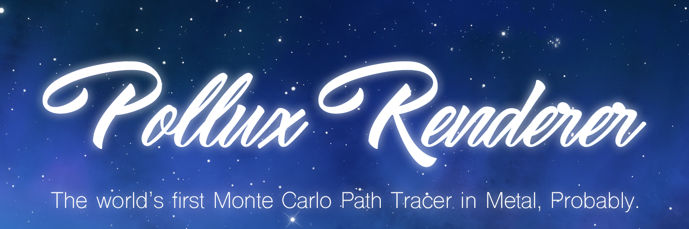

Tested on: 
- **macOS Version:** MacBook Pro (Retina, 13-inch, Early 2015) running macOS Sierra 10.12.6
- **iOS Version:** iPhone 6 running iOS 10.2

       

- [Build Instructions](#build-instructions)

- [Scene Setup Instructions](#scene-setup-instructions)

- [Code Structure](#code-structure)

- [Features](#features)

- [Analysis](#analysis)

- [Potential Improvements](#potential-improvements)

- [Bloopers](#bloopers)
 

____________________________________________________

** Add Overview Image**

Pollux is a Monte Carlo Path Tracer built completely in Metal. It can run on both macOS and iOS.

### Build Instructions

[Select the appropriate scheme](/Debug\ Views/scheme.png) and run by clicking on the play button.

If you are running on iOS you must run on an actual device as Metal is not supported on the simulator.

### Scene Setup Instructions

Scenes are described in a `json` file format. Where each file must contain:

A `camera` dictionary with entries for:
 - `fov`: the camera's field of view
 - `depth`: the depth of the rays cast
 - `pos`: an array containing 3 floats EXACTLY, detailing the position of the camera in the scene
 - `lookAt`: an array containing 3 floats EXACTLY, detailing the target that the camera is looking at
 - `up`: an array containing 3 floats EXACTLY, detailing the direction of "up" for the camera

A `materials` array of dictionaries with each material having entries for:

- `bsdf`: the type of bsdf it is. BSDF types are defined as -1 for light, 0 for diffues, and `TODO: ADD MORE BSDF TYPES`
- `name`: the name for a material. This is not used in code, but helpful for reading the scene file.
- `color`: the albedo color of the material. `TODO: Add Texture Map?`

 A `geometry` array of dictionaries with each geometry having entries for:
 
 - `name`: "Sphere" the name of the geometry, useless in code, but helpful for reading the scene file.
 - `type`: the geometry type. The current types are `0 = SPHERE`, `1 = CUBE`, `TODO: Add meshes?`
 - `material`: the index of the material that this geometry has. Not to be confused with `bsdf`. This is just the index of a material from the materials array.
 - `translate`: an array containing 3 floats EXACTLY, indicating the translation of the geometry in the x, y, and z axes respectively.
 - `rotate`: an array containing 3 floats EXACTLY, indicating the rotation of the geometry around the x, y, and z axes respectively.
 - `scale`: an array containing 3 floats EXACTLY, indicating the scale of the geometry in the x, y, and z axes respectively.
 
 An optional `environment` dictionary with entries for:
 
 - `filepath` : the name of the image file to be used
 - `emittance` : an array containing 3 floats EXACTLY, indicating the illumination of the environment map
 

Example scenes can be found in the `Scenes/` folder.

### Code Structure

In order to make the code as portable as possible to different platforms, the UI is as simple as it gets: One ViewController with its view being cast as an `MTKView` to potentially take advantage of Direct-To-Display capabilities in Tier 2 devices.

As soon as the view controller loads, a `PolluxRenderer` is instantiated that handles everything. `PolluxRenderer` conforms to the `MTKViewDelegate` protocol and renders everything. In the initializer, it sets up the entire compute pipeline, and then later at each step, it calls `pathtrace()` which then sets the appropriate pipeline stages:

- `GENERATE_RAYS`: Generates rays from the camera. This happens once per compute iteration.
- `COMPUTE_INTERSECTIONS`: Computes the intersections of the rays with the objects in the scene. This happens `depth` number of times per compute iteration.

- `SHADE`: Accumulates color at each bounce based on the intersection with the ray and scene. It then reflects the ray off the object. This also happens `depth` number of times per compute iteration.

- `FINAL_GATHER`: After the ray has been bounced around, it adds the ray's accumulated color to the frame buffer and displays it.

##### Data Structures / Frameworks Created:

**`PlatformXXXXXXXX`**:
In order for this project to work with both macOS and iOS, I had to consolidate the different types of View elements for different platforms. In order to do that, I use a process Apple calls "Shimming", which basically defines types based on what OS that this is being built on. This is done using preprocessor flags. A very helpful description of this can be found in [this WWDC talk from 2014](https://developer.apple.com/videos/play/wwdc2014/233/). Because there are different names for different data types between macOS and iOS, I just define the appropriate data type using a preprocessor `#if` and a `typealias` (which is exactly like `typedef` in c) to make sure that the right type is being used. An example of this is how in macOS view controlles are called `NSViewController`, but in iOS they are called `UIViewController`. I just set the appropriate name to a unified `PlatformViewController` that I can use throughout the code without having to worry about platform compatability. The full list of defined types is available in `PlatformTypes.swift`.

**`SharedBuffer<T>`**:
This project required the development of lots of support data structures to handle data management between the CPU and GPU. Luckily, I was able to encapsulate most large buffers in a `SharedBuffer<T>` class that represents a buffer that is accessible to both the GPU and CPU, with its storage mode being `.storageModeShared`. This allowed me to very cleanly use a buffer across the CPU and GPU with as much code as I would had it been an array on the CPU. The code is also extendable to all data types supported on the GPU, so feel free to use the code for any other Metal project you may need. `TODO: Port this file to a framework/separate repo`.

**`simd_la`**:
All of my linear algebra calculation is done using `simd` types, which runs operations using `simd` processing to optimize linear algebra calculations. There is already a very comprehensive linear algebra toolkit using these types, but I found that there wasn't anything that did 3D space manipulations using them. So I created a mini-linear algebra library for `translate`, `rotate`, and `scale` operations for 3D vectors. This is used when I create the transformation matrices during scene parsing.

**`Loki`**:
By far my favorite name for anything of made, this is basically a pseudo-random number generator built completely in Metal. `TODO: bundle this up into a framework/separate repo`. This took around 2 days to get to work, because random number generators are very important with Monte Carlo based calculations because any periodic behavior is instantly visible to the viewer. I realized very quickly that variance was not as important as the rng's period when I first used [this](http://www.cs.wm.edu/~va/software/park/park.html) code as a framework and found very noticeable artifacts in the image. The final implementation is based on [this research paper](http://iopscience.iop.org/article/10.1088/1742-6596/368/1/012024/pdf) from 2012 that uses a combination of which a hybrid approach combining LFSR with a Linear Congruential Generator (LCG) in order to produce random numbers with periods of well over 2^121. This works very well in my code. I also extended the algorithm to combine up to three seeds, which in my case are the `threadid`, `iteration`, and `depth` of each ray.

### Features

[ ] Scene file loading
[ ] Naive Shading
[ ] Multiple Importance Sampling
[ ] Stream Compaction
[ ] Acceleration Structure / GLTF Loading?
[ ] AR Kit??

### Potential Improvements

- **Better CPU/GPU Synchronization**
Can't figure out how to work with semaphores for some reason. If any prospective reader wants to take a crack at it, look for `MARK: SEMAPHORE CODE` in `PolluxRenderer.swift`.

- **Implement a multi-buffer model to speed up write to display times**
There's a way to do this, just can't figure it out.

- **Play around with different memory storage modes for the Shared Buffers**

- **Look into faster linear algebra computations in Metal (maybe using MPS?)**

- **Different memory address spaces in my shaders for local variables**

### Debug Views

`TODO: Add Debug Views`

### Analysis

### Bloopers

